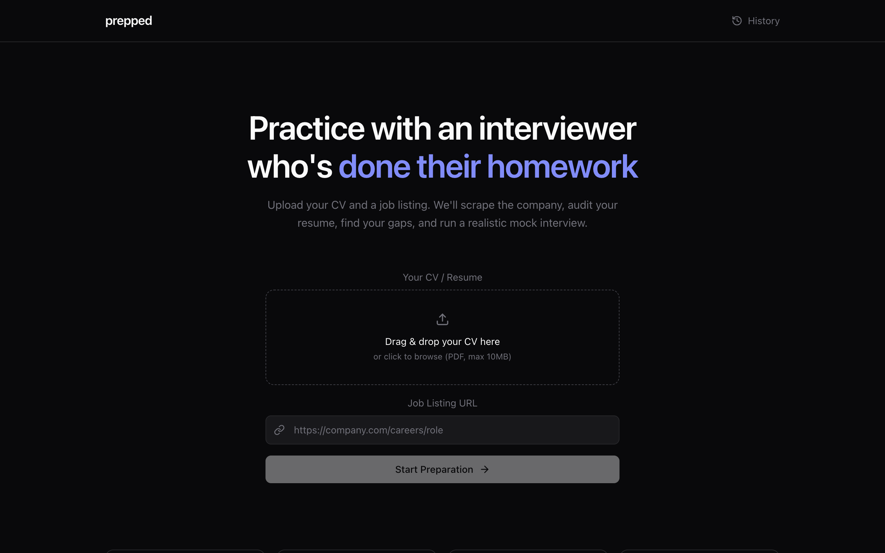
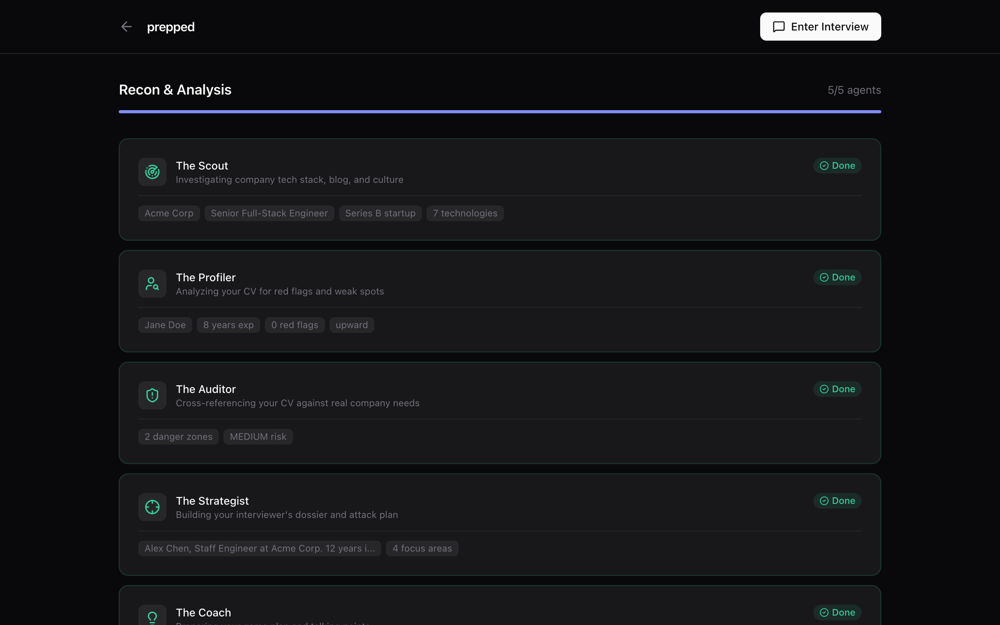
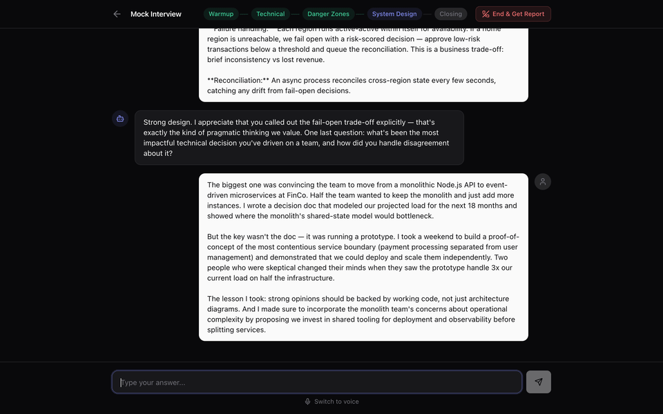
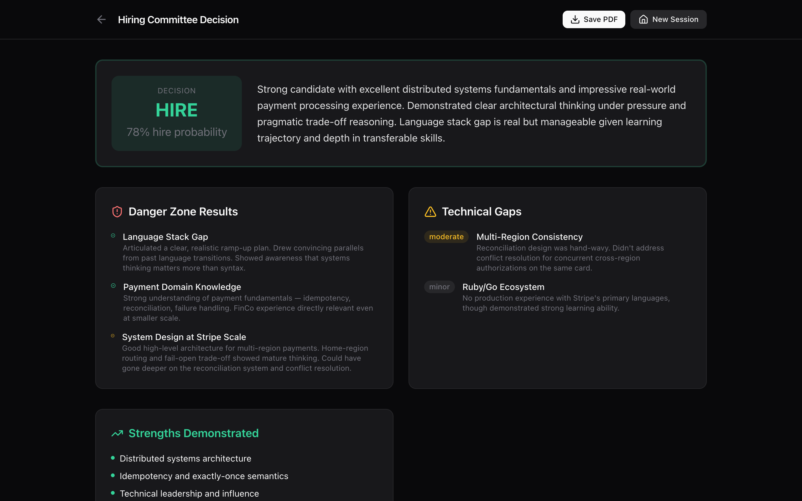

<p align="center">
  <h1 align="center">Prepped</h1>
  <p align="center">
    AI-powered mock interviews that actually know where to challenge you
  </p>
</p>

<p align="center">
  <a href="#quick-start">Quick Start</a> &nbsp;&bull;&nbsp;
  <a href="#how-it-works">How It Works</a> &nbsp;&bull;&nbsp;
  <a href="#features">Features</a> &nbsp;&bull;&nbsp;
  <a href="#llm-providers">LLM Providers</a> &nbsp;&bull;&nbsp;
  <a href="#contributing">Contributing</a>
</p>

---

Upload your CV and a job link. Five AI agents analyze the company, audit your resume, find your weak spots, and build an interviewer with a strategy for exposing your gaps.

This is not a generic "tell me about yourself" chatbot. The interviewer knows the company's tech stack, has read your CV, and knows exactly where to push.

<p align="center">
  
</p>

## Quick Start

```bash
git clone https://github.com/rroberman/prepped.git
cd prepped
npm install
cp .env.example .env.local
# Edit .env.local and add your API key
npm run dev
```

Open [http://localhost:3000](http://localhost:3000), upload a CV (PDF), paste a job URL, and go.

### Try it without an API key

Want to explore the UI first? Seed a demo session with pre-generated data:

```bash
npm run seed
npm run dev
```

This creates a complete session — agent analysis, interview messages, and a hiring committee report — so you can click through everything without needing an LLM provider.

## How It Works

### 1. Five agents analyze everything

Before your interview starts, a pipeline of specialized agents works in parallel waves:

- **Scout** scrapes the job posting, company site, and engineering blog
- **Profiler** reads your CV like a skeptical hiring manager
- **Auditor** cross-references your CV against the job to find danger zones
- **Strategist** builds the interviewer's game plan
- **Coach** prepares you with talking points and strategies for weak spots

<p align="center">
  
</p>

### 2. A real interview, not a quiz

Five phases — warmup, technical deep dive, danger zones, system design, and closing. The interviewer follows the Strategist's plan, adapts to your answers, and only asks about what's actually in the job posting and your CV.

<p align="center">
  
</p>

### 3. A hiring committee tells you the truth

Afterward, you get a hire/no-hire decision with per-question feedback, danger zone results, technical gaps, and specific recommendations for what to work on.

<p align="center">
  
</p>

## Features

**Interview**
- Four difficulty levels — Friendly (practice), Realistic (standard), Tough (FAANG-level), Adaptive (adjusts to your performance)
- Adaptive mode starts at Realistic and escalates or de-escalates based on your answer quality — with dual scoring in the report (interviewer's live assessment vs. committee retrospective)
- Voice mode with browser speech recognition and TTS (free) or OpenAI TTS (natural voice)
- Multi-language voice — English, Hebrew, Arabic, Spanish, French, German, Russian, Chinese, Japanese

**Cross-Session Insights**
- Sessions auto-grouped by CV and company — or manually labeled
- Track recurring danger zones, consistent strengths, and resolved gaps across interviews
- Skill coverage map — which skills got tested vs. identified but never probed
- Difficulty progression — see when you're ready to move up
- Side-by-side session comparison

**Infrastructure**
- Works with OpenAI, Anthropic, Google Gemini, OpenRouter, or local models via Ollama
- SQLite database — no external services needed
- Fully local — your CV and data stay on your machine
- Token usage tracking with estimated cost per session

## LLM Providers

Set `LLM_PROVIDER` in `.env.local`:

| Provider | Env Var | Models |
|----------|---------|--------|
| **OpenAI** (default) | `OPENAI_API_KEY` | gpt-4o, gpt-4o-mini |
| **Anthropic** | `ANTHROPIC_API_KEY` | claude-sonnet-4-20250514, claude-haiku-4-5-20251001 |
| **Google Gemini** | `GEMINI_API_KEY` | gemini-2.5-flash, gemini-2.5-pro |
| **OpenRouter** | `OPENROUTER_API_KEY` | Any model via OpenRouter |
| **Ollama** (local) | `OLLAMA_BASE_URL` | llama3, mistral, etc. |

## Contributing

Contributions welcome! See [CONTRIBUTING.md](CONTRIBUTING.md) for setup instructions, testing, and PR guidelines.

Some areas that could use help:

- **Better scraping** — many job sites block scrapers or render with JS
- **More LLM providers** — AWS Bedrock, Azure OpenAI, Groq, etc.
- **Interview customization** — adjustable length, focus areas
- **i18n** — UI translations (the interview itself already adapts to the candidate's language)

## License

MIT
